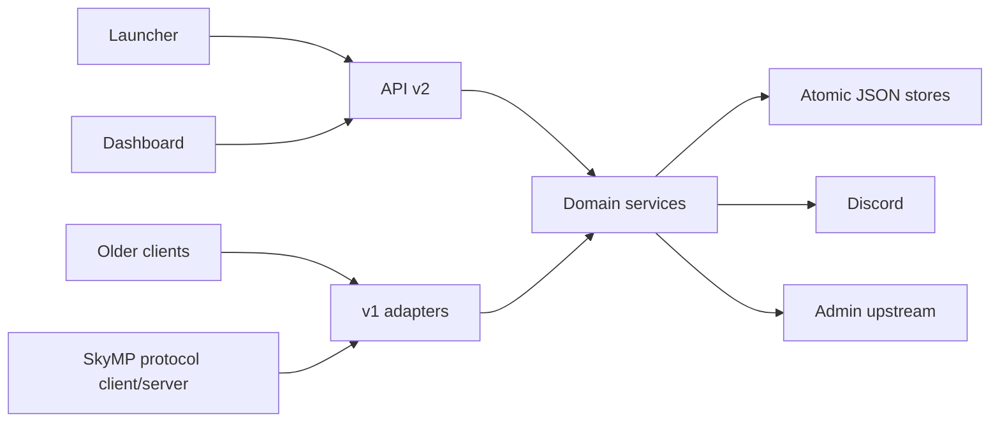

# Architecture

## Runtime

One Node.js process owns three explicitly managed services:

1. the public Express API;
2. the static management dashboard on its own port;
3. the SkyMP WebSocket relay.

The Discord bot is an optional integration in the same lifecycle. `src/index.js` loads the environment and delegates to the runtime bootstrap. The bootstrap starts services in order, rolls back partial startup, and closes them in reverse order on `SIGINT` or `SIGTERM`. Importing the app builder never opens a port.

## Module boundaries

- `launcher` owns public launcher data, client distribution, status and launcher releases.
- `auth` owns Discord login state and persisted play/dashboard sessions.
- `game-servers` owns heartbeats and the SkyMP-facing master API.
- `players`, `access` and `factions` own their respective state and rules.
- `content` owns lore, rules and staff-maintained content.
- `admin` owns dashboard authentication, administrative routes and the upstream admin proxy.
- `integrations` contains Discord, GitHub and WebSocket adapters.
- `shared` contains storage and HTTP infrastructure only.

Routers call domain services; domain services do not import routers. Legacy and v2 routes share the same services, so compatibility behavior cannot create a second source of truth.

## Request and data flow

JSON writes use a temporary file followed by an atomic rename. The data-path resolver uses the canonical domain path, or the legacy flat path when an installation has not run the migration yet. Conflicting copies stop access with an actionable error instead of choosing silently.
